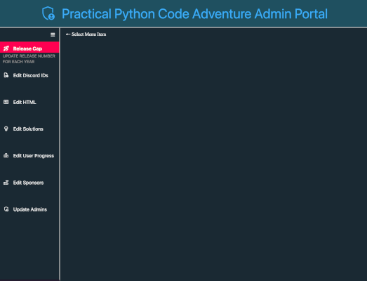

# Practical Python Code Adventure v2


> **`🌐 Live at:`** [https://adventure.practicalpython.org](https://adventure.practicalpython.org)

Version 2 of **Code Adventure** brings a fully modular backend, a redesigned user experience, and flexible setup options for new or returning deployments.

The project is a series of interactive coding challenges (each with two parts), inspired by [Advent of Code](https://adventofcode.com), built for the [Practical Python Discord community](https://github.com/practical-python-org). Challenges are now organized into yearly collections of 10, with a new set released each year.

All previous features have been preserved and improved, with better code structure, usability, and deployment options.

---

## Key Updates in Version 2

- **Modular Backend** – Blueprints, services, and templating are now separated for clean, maintainable code.
- **Updated Database** – New PostgreSQL schema for version 2 challenges, with optional migration from version 1.
- **Flexible Setup Options** – Start fresh or carry over progress from version 1 using `SETUP_TYPE`.
- **Redesigned UX** – Clearer layout, more eye-catching style, and expanded site content.
- **Submission Cooldown** - Server-side timer that prevents repeated submissions and discourages brute-force guessing.
- **Challenge Organization** – Puzzle inputs and media now structured for multiple years, simplifying future expansion.
- **Improved Admin Dashboard** – Modular routes and updated UI for managing users, challenges, sponsors, and releases.

---

## Tech Stack

- 
- 
- 
- 
- 
- 
-  

---

## Getting Started

### Prerequisites

- Python 3.10+
- Docker & Docker Compose
- PostgreSQL (local or Docker-based)

> ⚠️ Python 3.10+ is required due to `uv` dependency management.

---

### Environment Variables

Create a `.env` file in the project root (you can copy `.env.EXAMPLE` and fill in the values):

```ini
# PostgreSQL
POSTGRES_USER="postgres"
POSTGRES_PASSWORD="postgres"
POSTGRES_SERVER="postgres"
POSTGRES_PORT="5432"
DATABASE_NAME="YOUR_DB_NAME"

# Flask
FLASK_PORT=5000
FLASK_ENV="production"  # or "development"
SECRET_KEY="Something_secret_goes_here"

# Discord
DISCORD_ADMIN_USER_ID="YOUR_ADMIN_ID"  # Used in entrypoint.sh
DISCORD_REDIRECT_URI="BASE_URL_HERE/callback"
DISCORD_CLIENT_ID="YOUR_CLIENT_ID"
DISCORD_CLIENT_SECRET="YOUR_CLIENT_SECRET"
DISCORD_BOT_TOKEN="YOUR_BOT_TOKEN"

# DB Setup in Docker Container
SETUP_TYPE="setup"   # To setup a new blank DB
#SETUP_TYPE="update" # To update from the 2025 DB without clearing user progress

# Latest Year
YEAR=2026
KEY2025="KEY_HERE"
KEY2026="DIFFERENT_KEY_HERE"
# Add keys for other released years as needed
```

> **POSTGRES\_\* variables / DATABASE_NAME** – DB credentials and host info.

> **FLASK_PORT** – Port Flask runs on (default 5000).  
> **FLASK_ENV** – Set to `development` or `production`.
> **SECRET_KEY** – Used for securely signing application data and tokens.

> **DISCORD_ADMIN_USER_ID** – Your Discord user ID for admin dashboard access.  
> **DISCORD\_\* tokens** – OAuth2 credentials for authentication and bot access.

> **SETUP_TYPE** – `setup` = new DB, `update` = migrate from 2025 DB without clearing progress.

> **YEAR** – Latest challenge year to include (starting from 2025). _Must not exceed released years_.  
> **KEY####** – Required key to access each year’s challenge and solution data to fill the DB.

To obtain KEYs, contact the project owner via [Discord](https://discord.com/users/609283782897303554) or by [email](mailto:jefethepug@protonmail.com).

---

### Local Development

1. **Clone the repository**:

```bash
git clone https://github.com/JefeThePug/Zorak-Coding-Challenges.git
cd Zorak-Coding-Challenges
```

2. **Install dependencies with uv**:

```bash
uv sync --frozen --no-dev --system
```

3. **Run the initial setup**:

- For a blank DB: `python setup.py`
- To migrate from version 1: `python update_from_2025.py`

4. **Start the application**:

```bash
python -m app.run
```

5. **Access the app**: [http://localhost:5000](http://localhost:5000)

---

### Running with Docker

1. **Build and start containers**:

```bash
docker-compose up --build
```

2. **Access the app**: [http://localhost:5000](http://localhost:5000)

> The Flask app connects to PostgreSQL using the hostname defined in `POSTGRES_SERVER` in your `.env`.

---

## Usage Overview

- **Login** – Authenticate via Discord to track progress.
- **Challenges** – Access version 2 challenges, each with two parts.
- **Submit Solutions** – Correct answers update progress and unlock discussion threads.
- **Admin Tools** – Modular dashboard for managing users, challenges, sponsors, and releases.

---

## Code Structure Highlights

- **`app/blueprints/`** – Routes organized by functionality: `auth`, `challenge`, `admin`, `main`, `errors`.
- **`app/services/`** – Backend services for cooldowns, progress, and Discord notifications.
- **`app/templating/`** – Global functions and utilities for rendering templates.
- **`setup.py` & `update_from_2025.py`** – Setup a blank DB or migrate from version 1.
- **`app/static/` & `app/templates/`** – Organized media and templates for multiple years, with year-specific style overrides.

---

## Admin Dashboard

The admin dashboard allows easy management of Discord channel assignment, user progress, challenge content, and sponsor info. Here's a quick look:

  
_↗️ Looping demo of the admin dashboard showing user and challenge management._

---

## Sponsorship

`Version 2 now supports sponsorship.`

**Sponsorship helps maintain the server, fund new challenges, and support ongoing development.**

Individuals or companies can support the project financially. Sponsors are acknowledged on the site and help maintain and expand new challenges, infrastructure, and features. Contact the project owner for details on sponsoring.

---

## Contributing

Contributions can include:

- Providing new challenge ideas
- Providing feedback or suggestions on frontend UX
- Updating backend services
- Discovering / fixing bugs
- Improving documentation

---

## License

Open-source, intended for educational and community-building use.

---

## Acknowledgments

- Inspired by [Advent of Code](https://adventofcode.com)
- Built for the [Practical Python Discord](https://github.com/practical-python-org)
- Thanks to community members who tested and provided feedback for version 2.<br>
  **Individual credit is acknowledged on [the website](https://adventure.practicalpython.org/gratitude).**
